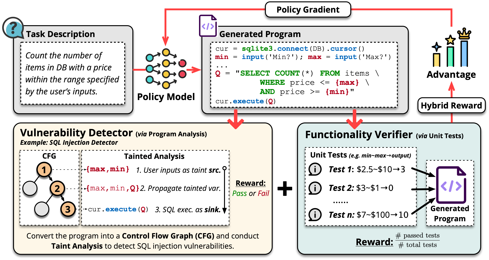
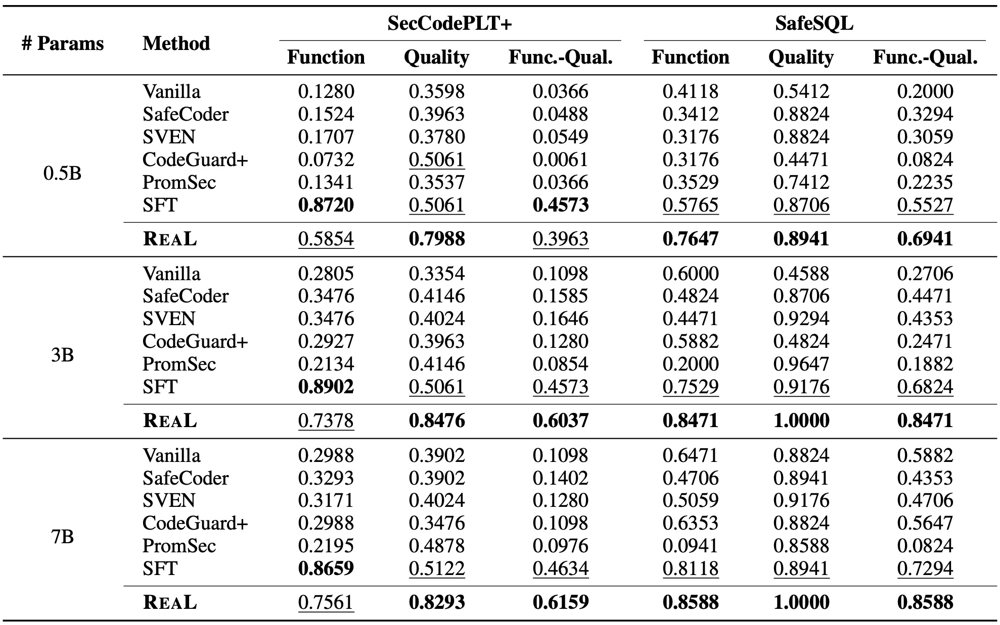

<h1 align="center"> 🛡️ ReaL 🛡️ </h1>
<p align="center"> <b>Reinforcement rEwards from Automated program anaLysis</b> 
</p>
<p align="center">
  
  
  <a href="https://arxiv.org/abs/2505.22704"></a>
</p>  
<p align="center"> 
ReaL is a <strong>reinforcement learning</strong> framework implemented on <a href="https://github.com/volcengine/verl">VeRL</a> that integrates automated <strong>program analysis</strong> techniques to train language models to generate secure, maintainable, and production-quality code.
</p>

---

## 📋 Contents

- [🔍 Overview](#-overview)
- [🚀 Key Components](#-key-components)
- [⚡ Quick Start](#-quick-start)
- [🛠️ Full Setup](#️-full-setup)
- [📊 Results](#-results)
- [📜 Citation](#-citation)
- [📬 Contact](#-contact)

---

## 🔍 Overview

The rise of **vibe coding**—a term coined by [Andrej Karpathy](https://x.com/karpathy/status/1886192184808149383?lang=en)—has transformed software development by enabling individuals to generate code through natural language prompts. Tools like **[Cursor](https://www.cursor.com/)**, **[Replit](https://replit.com/)**, and **[ChatGPT](https://chatgpt.com/g/g-CfL5dQPbs-code-generator)** have made this approach accessible, allowing for rapid prototyping and democratizing coding for non-programmers.

However, while vibe coding excels in speed and functionality (e.g., passing unit tests), it often lacks the robustness required for production-level code—leading to critical issues in **security** (e.g., SQL injection) and **maintainability** (e.g., missing type annotations, poor structure).

**ReaL** bridges this gap by integrating **automated program analysis** with **unit test feedback** during training. Unlike prior work focused only on correctness, ReaL provides **reference-free**, **prompt-agnostic** rewards that explicitly incentivize the generation of **secure**, **clean**, and **production-quality** code.

> ✨ ReaL makes vibe coding not just fast — but **safe**, **secure**, and **reliable**.

<p align="center">
  
</p>

### ✅ Key Advantages

- **Hybrid Reward System**: Combines static analysis (for security and maintainability) with dynamic unit testing (for correctness) to guide LLMs toward high-quality outputs
- **Reference-Free Supervision**: No ground-truth labels or hand-crafted rules — models learn directly from automated analysis signals
- **Easy Integration**: Built on [VeRL](https://github.com/volcengine/verl), a popular and user-friendly RL framework that makes ReaL accessible to researchers and practitioners
- **Scalability**: Supports LLMs from 0.5B to 7B (e.g., Qwen2.5) with seamless PPO integration
- **Enhanced Safety**: Targets real-world vulnerabilities using detectors for 17+ CWEs, and enforces best practices for long-term maintainability

---

## 🚀 Key Components

- **Automated Feedback**: Leverages static program analysis (for security and maintainability) and dynamic unit testing (for correctness)
- **Reference-Free Training**: Reinforcement learning with hybrid rewards — no need for case-by-case human-labeled data for safety and security requirements
- **Robust Evaluation Benchmarks**:
  - 🧪 **SafeSQL** – realistic SQL tasks with injection vulnerabilities
  - 🔐 **SecCodePLT+** – security benchmark enhanced with 17+ CWE detectors
  - 🔧 **APPS+** – maintainability-focused version of the APPS dataset with static analysis checks
- **Scalable RL Setup**: Built on the popular [VeRL framework](https://github.com/volcengine/verl), making it easy to train Qwen2.5 models (0.5B–7B) with PPO

---

## ⚡ Quick Start

Get started with ReaL in just 3 commands:

```bash
# Clone and enter the repository
git clone https://github.com/yaof20/ReaL.git && cd ReaL

# Launch Docker environment and start training
bash docker/launch_docker.sh
cd ReaL && bash run/safesql/hybrid-0.5b.sh
```

---

## 🛠️ Full Setup

### 1. Environment Setup

#### Option A: Docker (Recommended)
```bash
git clone https://github.com/yaof20/ReaL.git && cd ReaL
bash docker/launch_docker.sh
```

#### Option B: Conda Environment
```bash
git clone https://github.com/yaof20/ReaL.git && cd ReaL
conda create -n real python=3.10 -y
conda activate real
bash install.sh
```

### 2. Training

Run training for your target dataset and model size:

```bash
# For SecCodePLT+  
bash run/seccodeplt/hybrid-[0.5b|3b|7b].sh

# For APPS+  
bash run/apps-code/hybrid-[0.5b|3b|7b].sh

# For SafeSQL  
bash run/safesql/hybrid-[0.5b|3b|7b].sh
```

> 💾 Checkpoints are automatically saved to: `checkpoints/[proj_name]/[exp_name]`

### 3. Evaluation

Execute the evaluation pipeline after training:

```bash
# For SecCodePLT+
bash experiments/safesql_and_apps/apps_eval_main.sh

# For APPS+
bash experiments/safesql_and_apps/apps_eval_main.sh [path_to_exp_dir] [sharded|single]

# For SafeSQL
bash experiments/safesql_and_apps/safesql_eval_main.sh [path_to_exp_dir] [sharded|single]
```

> ✅ The evaluation pipeline handles checkpoint formatting, response generation, and end-to-end quality assessment

---

## 📊 Results

We evaluate ReaL on three enhanced benchmarks:
- **SafeSQL**: Realistic tasks designed to catch SQL injection flaws
- **SecCodePLT+**: Code generation tasks with rich CWE coverage  
- **APPS+**: Classic algorithmic challenges augmented with static maintainability checks

<p align="center">
  
</p>

Across all settings, ReaL consistently outperforms state-of-the-art baselines—enabling LLMs to write code that's not just functional, but **secure and reliable by design**. Check our [paper](https://arxiv.org/abs/2505.22704) for more results!

---

## 📜 Citation

If you find this work useful, please cite:

```bibtex
@misc{yao2025real,
  title={Training Language Models to Generate Quality Code with Program Analysis Feedback},
  author={Feng Yao and Zilong Wang and Liyuan Liu and Junxia Cui and Li Zhong and Xiaohan Fu and Haohui Mai and Vish Krishnan and Jianfeng Gao and Jingbo Shang},
  year={2025},
  eprint={2505.22704},
  archivePrefix={arXiv},
  primaryClass={cs.CL}
}
```

---

## 📬 Contact

For questions or contributions, feel free to open an issue or reach out:  
📧 [zlwang@ucsd.edu](mailto:zlwang@ucsd.edu) • [fengyao@ucsd.edu](mailto:fengyao@ucsd.edu)